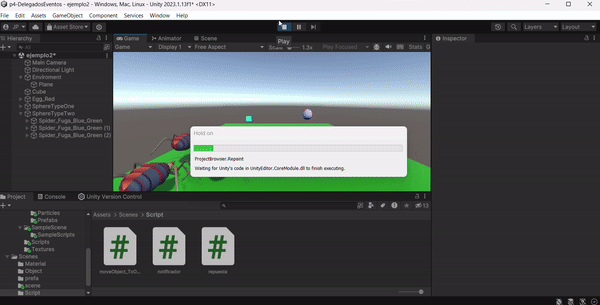
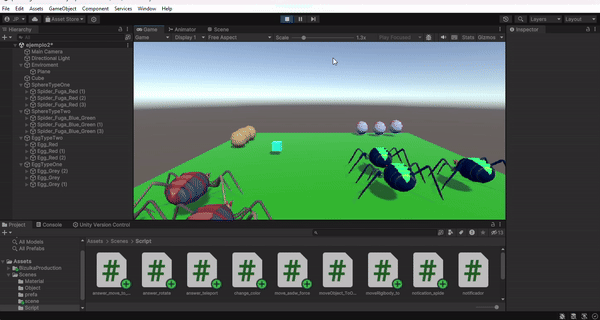

# Práctica 3: Interfaces Inteligentes
## Grado en Ingeniería Informática

### Alumno: Jose Fenic Peiteado Padilla

### Universidad de La Laguna
### Fecha: 12 de octubre de 2024

# Índice
1. [Situación 1](#escenario-1)  
2. [Situación 2](#escenario-2)
3. [Situación 3](#escenario-3)
4. [Situación 4](#escenario-4)
5. [Situación 5](#escenario-5)
6. [Situación 6](#escenario-6)
7. [Situación 7](#escenario-7)
8. [Situación 8](#escenario-8)
9. [Situación 9](#escenario-9)

---
## escenario 1
A partir de la escena que has estado utilizando en las últimas prácticas, crea la siguiente mecánica. Cuando el cubo colisiona con el cilindro, las esferas de tipo 1 se dirigen hacia una de las esferas de tipo 2 que fijes de antemano y las esferas de tipo 2 se desplazan hacia el cilindro.

> La solucion consitio en 3 script hacieno el patron de diseño explicado en clase Observado donde tenemos un objeto que se encargar de notificar para este ser el cilindro y tendra asociado un rigibody y el script de notificacion, y el resto de objetos tendra el noticador esperando a que el cilindro colisione con con el cubo.

## escenario 2

> En este caso simplemente se cambia los objetos por los assets que se solicitan y se le asocian los scripts de notificacion y el repuesta.

## escenario 3
Adapta la escena anterior para que existan arañas de tipo 1 y de tipo 2, así como
 diferentes tipos de huevo, tipo 1 y tipo 2:
 - Cuandoelcubocolisiona con cualquier araña tipo 2, las arañas en el
 grupo 1 se acercan a un objeto seleccionado. Cuando el cubo toca
 cualquier araña del grupo 1 se dirigen hacia los huevos del grupo 2 que
 serán objetos físico. Si alguna araña colisiona con uno de ellos debe
 cambiar de color.

 > Para este caso se utilizo 2 script notificadores uno para las arañas tipo 1 y otros tipo 2
 y de esta manera se asocia cada script a su respectivo objeto y se le asigna el objeto al que se debe dirigir.

 

## escenario 4

 Cuando el cubo se aproxima al objeto de referencia, las arañas del grupo 1 se
 teletransportan a un huevo objetivo que debes fijar de antemano.Las arañas del
 grupo 2 se orientan hacia un objeto ubicado en la escena con ese propósito.

> Se crea un trigger en una araña de esta forma si se acerca el cubo a la araña esta se teletransporta a un huevo
 utilizando la funcion de transform.position y se le asigna la posicion del huevo objetivo.
 
 

## escenario 5
Implementar la mecánica de recolectar huevo en la escena que actualicen la
 puntuación del jugador. Las arañas de tipo 1 suman 5 puntos y las arañas de tipo 2
 suman 10. Mostrar la puntuación en la consola.

> Se crea un script que se encarga de sumar los puntos y se le asigna a los huevos un trigger que al colisionar con una araña se suman los puntos correspondientes.

 

## escenario 6

Partiendo del script anterior crea una interfaz que muestre la puntuación que va obteniendo el cubo.

> Se crea el canvas y se le asigna un texto que se actualiza con la puntuacion que se va obteniendo.

 

## escenario 7

 Partiendo de los ejercicios anteriores, implementa una mecánica en la que cada 100 puntos el jugador obtenga una recompensa que se muestre en la UI.

> En este caso se crea el texto dentro del script y se añade al jeraquia del canvas y se utiliza una variable para controlar los puntos y cuando llega a un 100 o me se reinciia la puntuacion.

 

## escenario 8

Genera una escena que incluya elementos que se ajusten a la escena del prototipo y alguna de las mecánicas anteriores

> Se añade 2 prefats con un zombie y uno te tematica de hallloween y se le asigna un script de notificacion para que se dirijan a un objeto en concreto.

 

## escenario 9

Para este caso el problema es que la escena 3 ya lo tenia hecha con el cubo fisico
