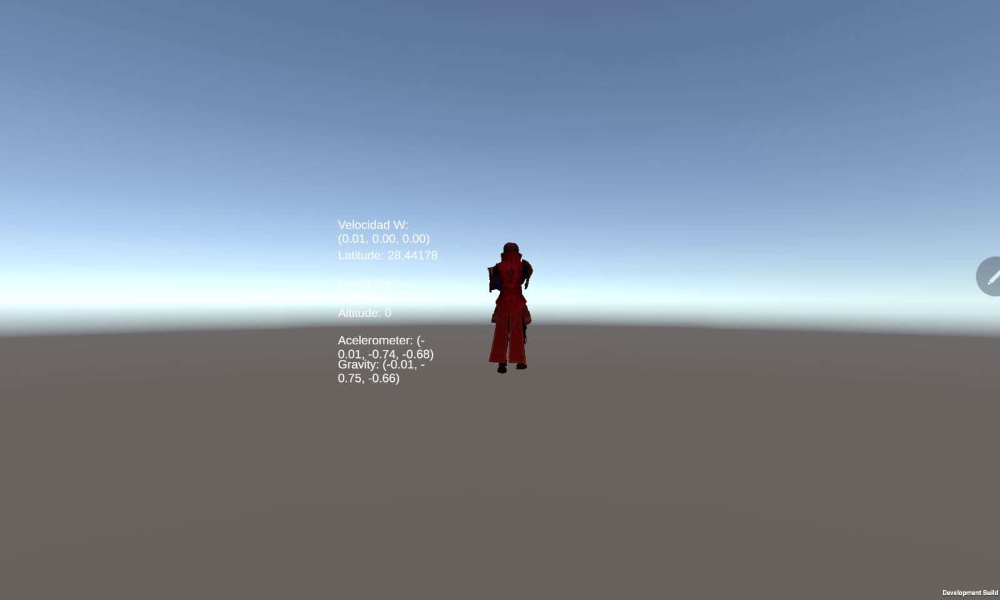
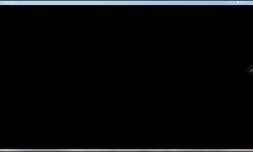

## Práctica de Sensores

### Objetivo
El objetivo de esta práctica es probar los sensores de un dispositivo Android, como el acelerómetro, el giroscopio y los sensores de ubicación. La aplicación muestra los valores capturados por estos sensores en una interfaz visual.

### Descripción
Se utiliza un *canvas* para mostrar los datos en tiempo real, como la velocidad angular, latitud, longitud, altitud, aceleración y gravedad. La aplicación también permite visualizar cómo un objeto (representado por un samurái) rota y se mueve basándose en los datos de los sensores. 

Los valores de los sensores se actualizan constantemente para reflejar el movimiento y la orientación del dispositivo.

> Ejemplo de Samurái en movimiento en dirección a al Norte.

>Se observa como depende la velocidad angular del dispositivo, la velocida del samurai.
