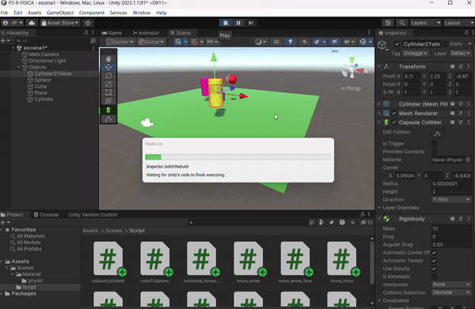

# Práctica 3: Interfaces Inteligentes
## Grado en Ingeniería Informática

### Alumno: Jose Fenic Peiteado Padilla

### Universidad de La Laguna
### Fecha: 12 de octubre de 2024

# Índice

 
1. [Situación 1](#situación-1)  
2. [Situación 2](#situación-2)  
3. [Situación 3](#situación-3)  
4. [Situación 4](#situación-4)  
5. [Situación 5](#situación-5)  
6. [Situación 6](#situación-6)  
7. [Situación 7](#situación-7)  
8. [Situación 8](#situación-8)  
9. [Situación 9](#situación-9)
10. [Fisicas](#fisicas)
11. [Ejercicio 1](#Ejercicio-1)
12. [Ejercicio 2](#Ejercicio-2)
13. [Ejercicio 3](#Ejercicio-3)
14. [Ejercicio 4](#Ejercicio-4)
15. [Ejercicio 5](#Ejercicio-5)
16. [Ejercicio 6](#Ejercicio-6)
17. [Ejercicio 7](#Ejercicio-7)
18. [Ejercicio 8](#Ejercicio-8)
19. [Ejercicio 9](#Ejercicio-9)
20. [Ejercicio 10](#Ejercicio-10)
21. [Ejercicio 11](#Ejercicio-11)
22. [Ejercicio 12](#Ejercicio-12)

---

### Situación 1:
El plano no es un objeto físico. El cubo es un objeto físico y la esfera no. En este caso, el plano y la esfera sólo tendrán collider, mientras que el cubo debe tener Rigidbody.

>En este caso puesto que el plano y le esfera son static collider no mueven, y el cubo es un dynamic collider, se espera que el cubo caiga sobre el plano y la esfera se quede en su lugar.

*Figura 1.1: El cubo cae sobre el plano mientras la esfera permanece en su lugar.*|

---

### Situación 2:
El plano no es un objeto físico. El cubo es un objeto físico y la esfera también. En este caso, el plano sólo tendrá collider, mientras que el cubo y la esfera deben tener Rigidbody.

> Para este caso los dos objeto dinamicos, el cubo y la esfera, caeran sobre el plano.  y el plano no se movera puesto que no tiene un rigidbody.

*Figura 1.2: El cubo y la esfera caen sobre el plano.*|

---

### Situación 3:
El plano no es un objeto físico. El cubo es un objeto físico y la esfera es cinemática. En este caso, el plano sólo tendrá collider, mientras que el cubo y la esfera deben tener Rigidbody, esta última cinemático.

> Para esta situacion el cubo caera sobre el plano, y la esfera se quedara en su lugar puesto que es cinemática.

*Figura 1.3: El cubo cae sobre el plano mientras la esfera permanece en su lugar.*|

---

### Situación 4:
El plano es un objeto físico. El cubo es un objeto físico y la esfera es física. En este caso, todos los objetos deben 
tener Rigidbody.

> Para esta situacion el cubo, la esfera y el plano caeran puesto que todo tiene un rigibody asignado y el mtoro de fisica se encargara de hacerlos caer, si en este caso  activamos las opción IsKinematic  evitaria que los objetos caigan.

*Figura 1.4: El cubo, la esfera y el plano caen.*|

---

### Situación 5:
El plano es un objeto físico. El cubo es un objeto físico y la esfera es física con 10 veces más masa que el cubo. En este caso, todos los objetos deben tener Rigidbody.

> Para esta situacion el cubo caera y el plano caeran a las misma velocida y esto se debe a que la velocida depende de la gravity y drag, por lo que caen a la misma velocidad, esto se aserca a la realidad puesto que la masa no afecta la velocidad de caida como se deja ver en la gif.

*Figura 1.5: El cubo y el plano caen a la misma velocidad.*|

---

### Situación 6:
El plano es un objeto físico. El cubo es un objeto físico y la esfera es física con 100 veces más masa que el cubo. En este caso, todos los objetos deben tener Rigidbody.

> Para esta situación sucede lo mismo que en la situación anterior, por lo que cambiar las masa no cambiara la velocidad de caida de los objetos.

*Figura 1.6: El cubo y el plano caen a la misma velocidad.*|

---

### Situación 7:
El plano es un objeto físico. El cubo es un objeto físico y la esfera es física con fricción. En este caso, todos los objetos deben tener Rigidbody.

> En caso realmente la situacion no cambia, puesto que la fricción no afecta la velocidad de caida de los objetos. Destacar la forma que se creo el material de la esfera, se crea un material con fricción 0 y 1( no se especifico si refiere a fricción estática o dinámica). y se añade en la parte del collider de la esfera.

*Figura 1.7: El cubo y el plano caen a la misma velocidad. pero ahora tiene fricción*|

---

### Situación 8:
El plano es un objeto físico. El cubo es un objeto físico y la esfera no es física y es Trigger. En este caso, todos los objetos deben tener Rigidbody.

>  En este caso la esfera no cae puesto que no tiene es un objeto fisico

*Figura 1.8: El cubo cae sobre el plano mientras la esfera permanece en su lugar.*|

---

### Situación 9:
El plano es un objeto físico. El cubo es un objeto físico y la esfera es física y es Trigger. En este caso, todos los objetos deben tener Rigidbody.

> Todo los objetos caen de igual forma, puesto que la esfera es un trigger, solo afectaria si los objetos la atraviesan con ella, solo se activaria el evento OnTriggerEnter.

*Figura 1.9: El cubo y la esfera caen sobre el plano.*|

---

## Fisicas

### Ejercicio 1:
Agrega un campo velocidad a un cubo y asígnale un valor que se pueda cambiar en
el inspector de objetos. Muestra la consola el resultado de multiplicar la velocidad
por el valor del eje vertical y por el valor del eje horizontal cada vez que se pulsan
las teclas flecha arriba-abajo ó flecha izquierda-derecha. El mensaje debe comenzar
por el nombre de la flecha pulsada.

> Para este ejercicios se declaro la variable 'public float' para que se pueda modifica desde el inspector, y luego se obtiene las el valor del ejes vertical y horizontal  y se multiplica por la velocidad, se introduce en el update con las funciones de event Input.GetKey(KeyCode) para obtener las teclas pulsadas y se imprime en la consola.

*Figura 2.1: Ejercicio 1*|

### Ejercicio 2:
Mapea la tecla H a la función disparo.

> En este caso solo hay que ir editor de Unity y en la pestaña de Edit -> Project Settings -> Input Manager -> Axes -> Add Key y se añade la tecla H, y se asigna a la función disparo.

*Figura 2.2: Ejercicio 2*|

### Ejercicio 3:
Crea un script asociado al cubo que en cada iteración traslade al cubo una cantidad
proporcional un vector que indica la dirección del movimiento: moveDirection que
debe poder modificarse en el inspector. La velocidad a la que se produce el
movimiento también se especifica en el inspector, con la propiedad speed.
Inicialmente la velocidad debe ser mayor que 1 y el cubo estar en una posición y=0.
En el informe de la práctica comenta los resultados que obtienes en cada una de las
siguientes situaciones:

a. **Duplicas las coordenadas de la dirección del movimiento.**

b. **Duplicas la velocidad manteniendo la dirección del movimiento.**

c. **La velocidad que usas es menor que 1.**

d. **La posición del cubo tiene y > 0.**

e. **Intercambiar movimiento relativo al sistema de referencia local y el mundial.**

> En este caso se observa diferentes escenario se observa como el vector de dirección y el speed afecta a la animacion final en cuanto a la velocidad y también sobre como mover los objetos en función de Space.Self y Space.World.

a. Para este caso se observa como el cubo se mueve a una velocidad mayor que si no se duplicara.

*Figura 2.3: Ejercicio 3.a*|

b. Para este caso succede los mismo se puede concluir con la linea que se utiliza para 'Translate(speed * moveDirection * Time.deltaTime);' se puede observar que la velocidad es mayor. 

*Figura 2.4: Ejercicio 3.b*|

c. Para este caso se observa que la velocidad es menor que en los casos anteriores, esto se debe a que la velocidad es menor que 1.

*Figura 2.5: Ejercicio 3.c*|

d. En caso succede un cambio en cuanto a la velocida , sino en la dirección debido a la posicion inicial de cubo.

/

*Figura 2.6: Ejercicio 3.d*|

e. Para el último caso no se observa un cambio puesto que los ejes locales y los ejes mundiale esta orientado de la angulos, por lo que para poder observa cambio se debe cambiar los ejes locales del objetos.

*Figura 2.7: Ejercicios 3.e*|

### Ejercicio 4:

 4. Mueve el cubo con las teclas de flecha arriba-abajo, izquierda-derecha a la velocidad
 speed. Cada uno de estos ejes implican desplazamientos en el eje vertical y
 horizontal respectivamente. Mueve la esfera con las teclas w-s (movimiento vertical)
 a-d (movimiento horizontal).

> Para este apartado se utilizo de la clase 'Input' los metodo 'GetKey'y 'GetAxis' para el cubo y la esfera respectivamente de forma que se tuvo configura la Input Manager del proyecto para que no afectara las teclas al 'GetAxis'

*Figura 2.8: Ejercicios 4*|

### Ejercicio 5:
5. Adapta el movimiento en el ejercicio 4 para que sea proporcional al tiempo
transcurrido durante la generación del frame.

> En este caso notaremos un cambio en cuanto al desplazamiento de los objeto porque se calcula en base al numero de frame que ha pasado, lo que resulta en velocidades más lenta en este ejemplo.

*Figura 2.9: Ejercicio 5*|

### Ejercicio 6:

6.  Adapta el movimiento en el ejercicio 5 para que el cubo se mueva hacia la posición
 de la esfera. Debes considerar, que el avance no debe estar influenciado por cuánto
 de lejos o cerca estén los dos objetos.

 > Para este caso hacemos uso del 'FindWithTag' de las funciones requerida por el problema para calcula direcion de los objetos hacemos la diferencia del objeto 'Sphere-Cube'

### Ejercicio 7:

7. Adapta el movimiento en el ejercicio 6 de forma que el cubo gire hacia la esfera.
 Realiza pruebas cambiando la posición de la esfera mediante las teclas awsd

 > En este caso, las Prueba fuero más confusa debido a que los moviento translate anteriomente no lo habia hecho en base 'Space.World' por lo que ahora la hora de hacer los movimiento pasaban situaciones poco intuitiva.

### Ejercicio 8:

8. Utilizar el eje “Horizontal” para girar el objetivo y que avance siempre en la dirección
 hacia adelante.

 > Se hizo uso de la función 'Input.GetAxis("Horizontal")' para obtener el valor del eje horizontal y se utilizo para rotar el objeto en el eje Y. y se utilizo la función 'Translate' para mover el objeto en la dirección que esta mirando

*Figura 2.10: Ejercicio 8*|

### Ejercicio 9:
9. Configura el cilindro como un objeto físico, cuando el cubo o la esfera colisionen con él se debe mostrar un mensaje en consola con la etiqueta del objeto que haya colisionado.

> Para este caso se utilizo la función 'OnCollisionEnter' para detectar la colisión con el cilindro y se imprime en la consola el nombre del objeto que colisiono.
Aclarar que alguno de los objeto debe tener un rigibody para que funcion ya que la llamda OnCollisionEnter se encarga el motor de fisica de unity.

*Figura 2.11: Ejercicio 9*|

### Ejercicio 10:

10. Configura el cubo como un objeto cinemático y la esfera como un objeto físico. Adapta los scripts del ejercicio 9 para obtener el mismo comportamiento.

> En este caso se hizo lo mismo que lo anterior pero se modifico el moviento de la esfera para que funcionara con
 AddForce en lugar del Translate y el bucle esta dentro un FixedUpdate en lugar de un Update.

*Figura 2.12: Ejercicio 10*|

### Ejercicio 11:
11. Configura el cilindro como un objeto de tipo Trigger. Adapta los scripts de los ejercicios anteriores para obtener el mismo comportamiento.

> En este caso se utilizo la función 'OnTriggerEnter' para detectar la colisión con el cilindro y se imprime en la consola el nombre del objeto que colisiono.

*Figura 2.13: Ejercicio 11*|

### Ejercicio 12:

12. Agrega un cilindro de un color diferente al que ya hay en la escena y configúralo como un objeto físico. 
Selecciona un conjunto de teclas que te permitan controlar su movimiento por la escena y prográmale un movimiento que permita dirigirlo hacia la esfera. 

> Para el desarrollo del moviento se utilizo las funcion 'Input', y para los moviento los metodo AddForce y AddTorque
la idea moverlo hacia adelante y hacia atrás además de rotarlo en el eje Y. Para dirigirlo hacia la esfera.

a. Prueba diferentes configuraciones de la esfera física con masa 10 veces mayor que el cilindro.

b. física con masa 10 veces menor que el cilindro.

c. cinemática.

d. trigger. 

e. Duplicar las friccion de la esfera o no.

Explica en el informe todos los resultados posibles. 

> Para este caso se utilizo la función 'Input.GetKey' para obtener las teclas pulsadas y se utilizo la función AddForce y AddTorque para mover el cilindro en la dirección de la esfera

>a. Para este primero caso tenemos que aumentar la masa de la esfera 10 veces más que el cilindro, por lo que tenemos 
que aumentar la fuerza que se le aplica al cilindro para que se mueva hacia la esfera.

>b. En este caso no tenemos que aplicar tanta fuerza puesto que el cilindro pesa menos.

>c. Si lo hacemos cinematico la diferencia es qua ya no lo moveremos con AddForce sino con Translate. sino no se movera

>d. Si lo hacemos trigger caera de a traves del plano.

>e. Si aumentamos la fricción de la esfera, el cilindro se movera con mayor dificultad por lo que se tendra que aplicar mayor fuerza.

