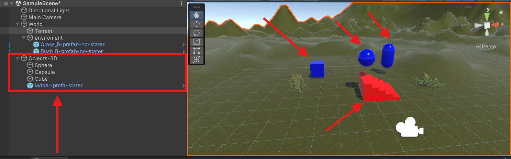
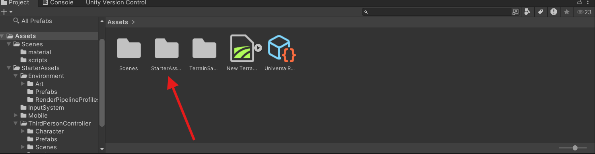
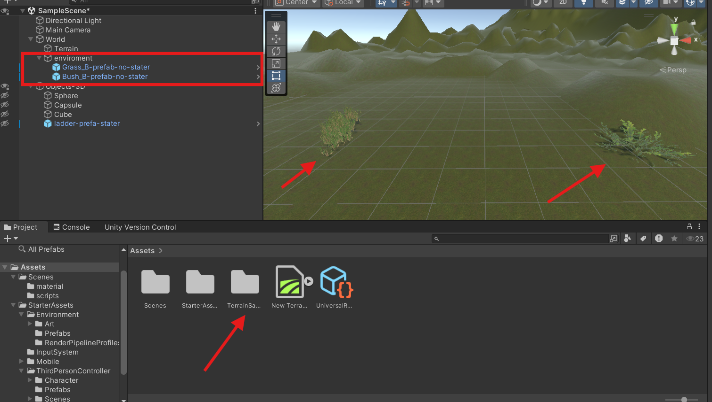
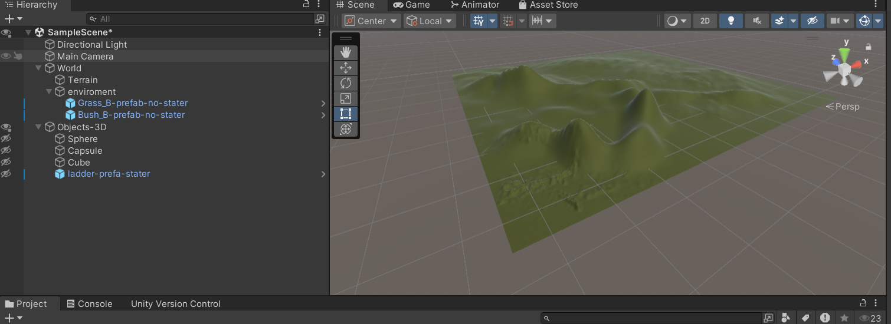
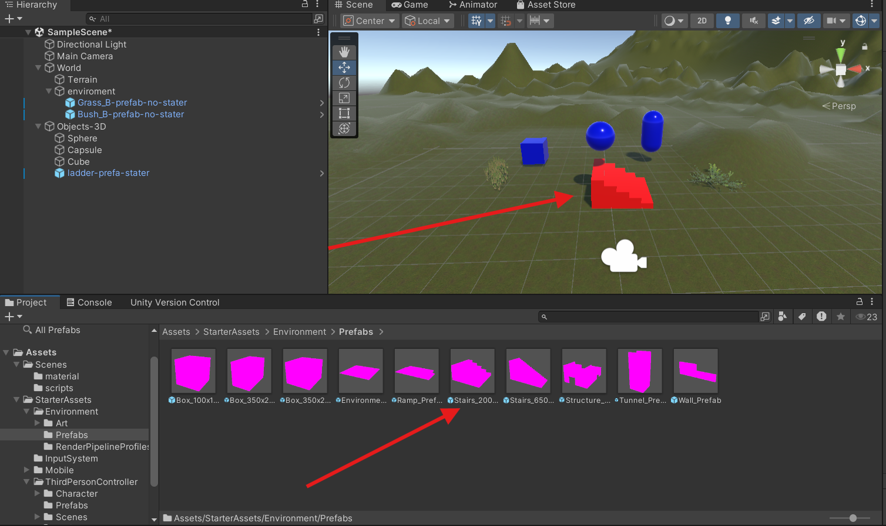
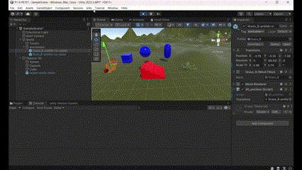

# Interface Inteligente
## Practica 1: Introduccion Unity

### Jose Fenic Peiteado Padilla

### Descripcion

- Incluir objetos 3D básicos
  Para la añadir objetos 3D Básicos se crearon varios objetos además de añadir material a los mismos.
  

- Inclusion de paquete Stater Assets
  Se busco en la pagina de la Asset Store el paquete de Stater Assets y se añadio a la escena.
  

- Incluir objetos de Asset Store que no Stater Assets
 Se añadio los [Terrain Sample Asset Pack](https://assetstore.unity.com/packages/3d/environments/landscapes/terrain-sample-asset-pack-145808) que se utilizo tanto objeto para el ambiente como el textura del terreno.

 

- Terreno
 Se añadio un terreno y se le añadio la textura del [Terrain Sample Asset Pack](https://assetstore.unity.com/packages/3d/environments/landscapes/terrain-sample-asset-pack-145808).
  

- Starte Asset Third Person
  Se añadio una escalera del starter asset third person. Para tener una animacion de una esfera bajando por la escalera.
  

- Animacion(GIF) 
 En el Gif podemos apreciar tanto la animacion de la esfera bajando por la escalera como la animacion de la camara.
 Como las coordenara los objetos utilizado asi como la tag asociadas a los objetos.
  

- Script
  Se añadio un script que muestra el nombre del tag y la posicion del objeto.

```csharp
using System.Collections;
using System.Collections.Generic;
using UnityEngine;

public class all_position : MonoBehaviour
{
    // Start is called before the first frame update
    // Variable Transform
    public Transform transform;
    // Variable Name
    void Start()
    {
          Debug.Log($"Nombre del objeto: {transform.gameObject.tag}, Posición: {transform.position}");
    }

    // Update is called once per frame
    void Update()//
    {

        
    }
}
```