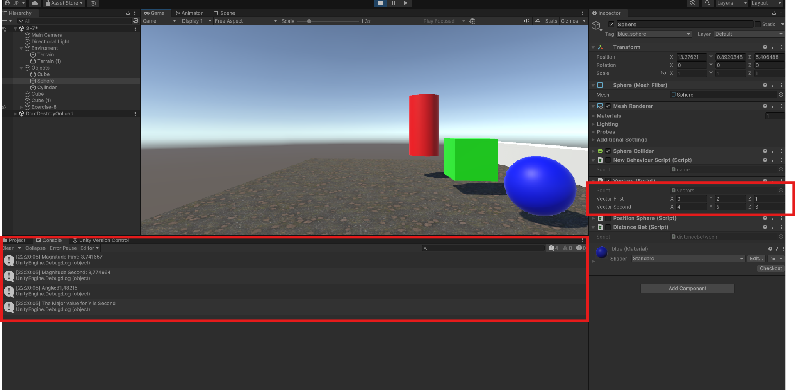
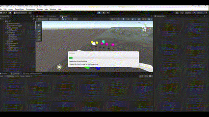

# Interfaces Inteligente
## Practica 2: Introducción C# - Scripts

- **Jose Fenic Peiteado Padilla**

Ejercicios para la practica 2 de la asignatura Interfaces Inteligentes.

1. Crea un script asociado a un objeto en la escena que inicialice un vector de 3 posiciones con valores entre 0.0 y 1.0, para tomarlo como un vector de color (Color). Cada 120 frames se debe cambiar el valor de una posición aleatoria y asignar el nuevo color al objeto. Parametrizar la cantidad de frames de espera para poderlo cambiar desde el inspector. 

Para este problema se declara la variable public para determina el limite de frame se establece un contador que se incremente en el update, y cuando el contador llegar al limite se cambia el color del objeto y se reinicia el contador.

2. Crea una escena simple en la que ubiques un plano y sobre él un cubo, una esfera y un cilindro. Cada uno de los objetos debe estar en un color diferente. En la consola cada objeto debe mostrar su nombre

En este siguio la instrucciones creando los materiales y asignadolos a los objetos

3. Crea un script asociado a la esfera con dos variables Vector3 públicas. Dale valor a cada componente de los vectores desde el inspector. Muestra en la consola:

    1. La magnitud de cada uno de ellos. 
    2. El ángulo que forman
    3. La distancia entre ambos.
    4. Un mensaje indicando qué vector está a una altura mayor.

Se declara las variable publica de tipo `Vector3` y se asigna los valores desde el inspector, y se calcula la magnitud, el angulo y las distancia entre los dos vectores, y se imprime en la consola.

- Magnitud: `magnitude`
- Ángulo: `angle`
- Distancia: `distance`

4. Muestra en pantalla el vector con la posición de la esfera

Para este problema se resolvio con el uso de la función `GetComponents` de `GameObject` para obtener las componentes `Transform` de la esfera

5.  Crea un script para la esfera que muestre en consola la distancia a la que están el cubo y el cilindro.

En este caso se utilizo la funcion `Vector3.Distance` para calculas las distancia entre los objetos y se hizo de uso de la funciones `GetComponents` y el atributo `position`.

6. Selecciona tres posiciones en tu escena a través de un objeto invisible (marcador) que incluya 3 vectores numéricos para configurar posiciones en las que quieres ubicar los objetos en respuesta a pulsar la barra espaciadora. Estos vectores representan un desplazamiento respecto a la posición original del objeto. Crea un script que ubique en las posiciones configuradas cuando el usuario pulse la barra espaciadora.

En esta parte del problema la solución no fue tan clara, por lo que se opto por hacer añadir una variable publica Vector3 a cada objeto para que luego ese vector fuera el desplazamiento que se le aplicara al objeto al pulsar la barra espaciadora. de esta la forma la solucion puede hacerse de manera similares a los ejercicios anteriores.  haciendo uso del inspector para asignar los valores de desplazamiento.

7. Cambia el color del cilindro cuando el usuario pulse la tecla C, cambia el color del cubo cuando el usuario pulse la flecha arriba.

Para este problema se utilizo la funcion `Input.GetKeyDown` para detectar la tecla pulsada y se cambio el color del objeto con la funcion `GetComponent<Renderer>().material.color`

8.Agrega 5 esferas más en la escena. Crea un grupo de 2 , asígnales la misma etiqueta para indicar esferas de tipo 1 y a las restantes otra etiqueta diferente a ésta para indicar esferas de grupo 2. En la escena también habrá un cubo. Implementa un script que aumente la altura de la esfera de tipo 2 más cercana al cubo. Cambia el color de la más lejana cuando el jugador pulsa la tecla espacio.

Para este problema se utilizo la funcion `FindGameObjectsWithTag` para obtener los objetos con la etiqueta correspondiente, luego se calculo la distancia entre el cubo y las esferas y se selecciono la esfera mas cercana para aumentar su altura y la mas lejana para cambiar su color.

